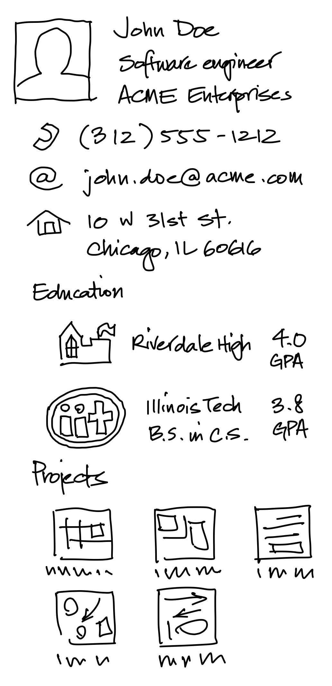
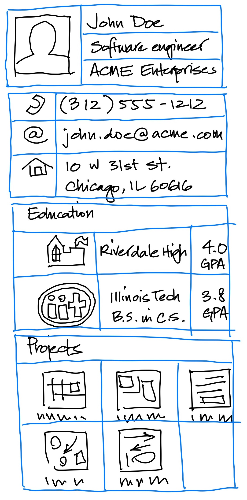

# CS 442 MP1: Profile Page

## Overview

In this initial machine problem (MP1), your task is to create a single-screen application that presents a "profile information" page for a user, either yourself or a fictional character, in a hypothetical social networking application. Examples of such apps include professional networking and dating apps.

The primary objective of this MP is to provide you with an opportunity to experiment with various display and layout widgets available in the Flutter framework. Additionally, you should focus on structuring your code in a way that promotes reusability and maintainability.


## Specifications

When executed, your application should display a single scrollable screen containing static user information organized into multiple visually distinct sections. These sections should align with the theme of the hypothetical social networking application. For instance, a professional networking app might feature sections like "Contact," "Education," and "Projects," while a dating app could include "About Me," "Interests," and "My Photos."

The layout and content of the profile page are open to your creative interpretation, but it must adhere to the following requirements:

- Include a minimum of four distinct sections, with each section visually distinguished using nesting, padding, background colors, or similar techniques.

- Incorporate at least three images.

- Utilize at least one nested row/column widget, where each nested widget contains a minimum of two children.

Here's a mockup of what the page might look like (scrolling should be supported, if needed, to view the entire page in the live application):



Here's a version with blue lines to indicate rows/columns/grids present in the layout.



## Implementation details / requirements

### Project setup

This repository already includes a basic Flutter project structure, which you should use as a starting point for your implementation. For this machine problem, you need only modify the `lib/main.dart` file. If you wish, you can create additional Dart files to organize your code (e.g., for custom widgets or data model classes -- discussed next), but this is not required.

You should also add any images you wish to use in the app to the `assets/images` directory. See the "Hints / Tips" section below for more details.

### User data model

While the layout and content of the page remain static, it is essential to structure your code to separate layout concerns from data. In other words, avoid hard-coding the content into the widget classes.

Instead, create one or more classes to represent and store user information, collectively referred to as your *data model*. Pass instances of these classes to your widgets for display. This approach allows you to change the displayed content without altering your widget code.

E.g., for the mockup above, you might define a `UserInfo` class that looks like the following:

```dart
class UserInfo {
  final String name;
  final String position;
  final String company;
  final String phone;
  final String email;
  final String address1;
  final String address2;

  // each entry is a record with named fields that describe a degree
  final List<({String logo, String name, double gpa})> education;

  // each entry is an instance of `ProjectInfo` that contains project details
  final List<ProjectInfo> projects;
  
  // ... constructor, etc.
}
```

Your `main` function, then, might be structured like this:

```dart
void main() {
  // build the user info object
  UserInfo userInfo = UserInfo(
    name: 'John Doe',
    position: 'Software Engineer',
    company: 'ACME Enterprises',
    phone: '(312) 555-1212',
    email: 'john.doe@acme.com',
    address1: '10 W 31st St.'
    address2: 'Chicago, IL 60616'
  );
  userInfo.addEducation(
    logo: 'assets/images/illinois-tech-logo.png',
    name: 'Illinois Tech',
    gpa: 3.8
  );
  // etc.

  // hand the user info object to the root widget
  runApp(MaterialApp(home: UserInfoPage(userInfo: userInfo)));
}
```

### Widget structure

While you have the freedom to experiment with different widget structures, ensure that your widget tree includes **at least one instance of each** of the following widget types (you can include multiple instances of some):

- `AppBar`
- `Column`
- `Container`
- `Image`
- `ListView`
- `MaterialApp`
- `Row`
- `Scaffold`
- `SizedBox`
- `Text`


Optional widgets that you may find useful/interesting:

- `Card`
- `Expanded`
- `GridView`
- `ListTile`
- `SingleChildScrollView`

Although not mandatory, it's highly recommended that you define more than one custom widget class. For example, you can create a `UserInfoPage` widget for the overall page layout and separate widgets for each section or "tile" within a section. This approach will improve code organization and facilitate layout changes.

## Testing

Since the page is static, functional testing is unnecessary. We will evaluate your submission by compiling and running it in a supported Flutter platform (e.g., MacOS, Windows, iOS, Android, or web) and visually inspecting the displayed page. We will view the page in a window of at least 1024x768 pixels, so ensure that your layout is legible at that size and has no overflow issues (scrolling is acceptable if needed).

Ensure that your code compiles and runs without errors before submitting it.

## Grading

This machine problem is worth 24 points. Your grade will be based on the following criteria:

- 8 points: The page layout complies with the specified requirements, and all information is displayed legibly.

- 8 points: Your code structure effectively separates layout from data, involving the use of data model classes and avoiding hardcoding user data within widget implementations.

- 8 points: Your code is well-structured, easy to read, and employs the required widgets and widget structures effectively.

If your code does not compile, you will receive a zero for the assignment. If your code compiles but does not meet the requirements, you will receive partial credit based on the extent to which it does.

## Submission

To submit your machine problem, commit and push your code to your private GitHub repository shared with us. You can make as many commits and pushes as needed; we will assess the most recent version of your code pushed before the deadline.

If you plan to use late submission days, remember to complete [a late day notice form](https://forms.gle/vUJjE2zAmqKc6Dfw6) before the deadline.


## Hints / Tips

- Refer to the "[Layout](https://docs.flutter.dev/ui/layout)" section and "[Building Layouts](https://docs.flutter.dev/ui/layout/tutorial)" tutorial for valuable insights into using various layout widgets.

- To include images in your page, place them in the `assets/images` directory of your project. Ensure that you add and commit them using Git. Displaying them is a matter of constructing `Image` widgets with appropriate paths, like this:
  
  ```dart
  Image.asset('assets/images/my-image.png')
  ```

  See the [Adding assets and images](https://flutter.dev/docs/development/ui/assets-and-images) page in the Flutter documentation for more details.

- Utilize VSCode's "Extract Widget" refactoring tool to assist in isolating sections of your code into separate widget classes. This approach is demonstrated in the "[Your first Flutter app](https://codelabs.developers.google.com/codelabs/flutter-codelab-first#0)" codelab assigned for the previous week.
